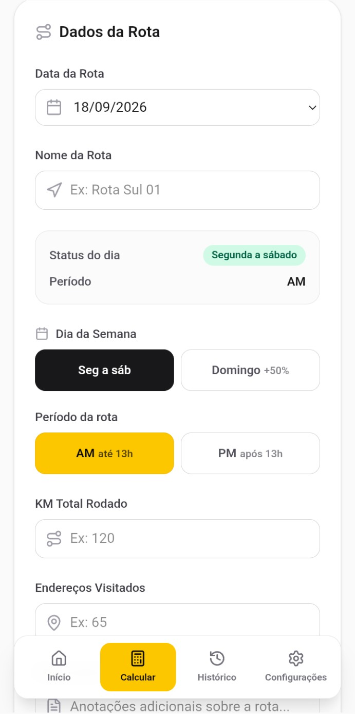
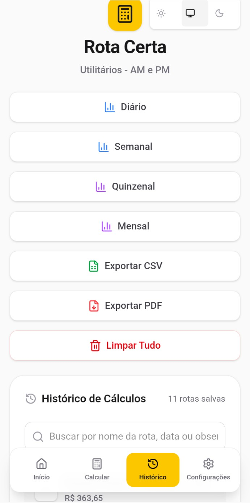
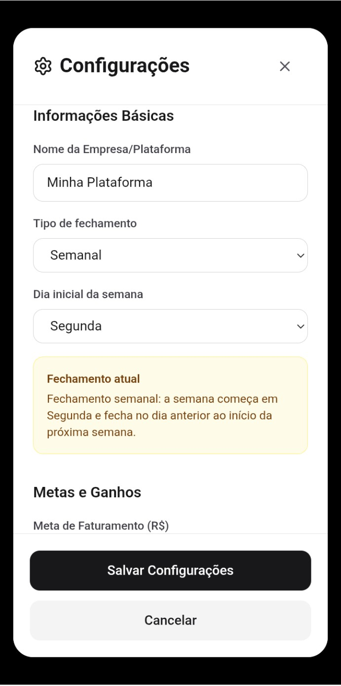

# 🚚 Rota Certa Pro

Aplicação mobile-first para cálculo, registro e acompanhamento de rotas de entregadores.

O projeto foi criado a partir de uma necessidade real de trabalho em logística: organizar rotas, acompanhar quilometragem, valores recebidos, períodos de fechamento e histórico de trabalho de forma simples e rápida.

Os dados são armazenados localmente no dispositivo, sem necessidade de backend para o uso principal da aplicação.


---

## 🎯 Objetivo do projeto

O Rota Certa Pro foi desenvolvido para ajudar profissionais que trabalham com entregas a organizar sua rotina operacional.

A aplicação permite acompanhar:

- rotas realizadas;
- quilometragem;
- quantidade de endereços;
- valores recebidos;
- períodos de fechamento;
- histórico de rotas;
- relatórios;
- backups dos dados.

O foco do projeto é manter uma experiência simples, rápida e adequada ao uso no celular durante a rotina de trabalho.

---

## ✨ Funcionalidades atuais

- cálculo de rotas AM e PM;
- regras específicas para domingos;
- registro de quilometragem;
- registro da quantidade de endereços;
- campo para observações;
- cálculo dos valores da rota;
- histórico de rotas;
- dashboard com indicadores;
- fechamento diário;
- fechamento semanal;
- fechamento quinzenal;
- fechamento mensal;
- exportação de dados em CSV;
- geração de relatórios em PDF;
- backup e restauração em JSON;
- tema claro;
- tema escuro;
- opção de seguir o tema do sistema;
- armazenamento local dos dados.

---

## 📱 Interface

O projeto foi desenvolvido com abordagem mobile-first.

### Dashboard


### Cálculo de rota



### Histórico



### Configurações



---

## 🛠️ Tecnologias

O projeto utiliza:

- React 19;
- TypeScript;
- Vite;
- Tailwind CSS;
- Capacitor;
- jsPDF;
- jsPDF AutoTable;
- Vitest;
- Lucide React.

---

## 🧪 Qualidade e testes

O projeto possui testes automatizados para partes importantes da aplicação, incluindo:

- regras de cálculo;
- períodos de fechamento;
- persistência local;
- exportação de arquivos;
- geração de PDF;
- estatísticas;
- componentes.

Para validar o projeto antes de enviar alterações:

```bash

npm test -- --run
npm run lint
npm run build

▶️ Executando o projeto localmente

Pré-requisitos
Node.js 22+
npm

Clone o repositório:

git clone https://github.com/aczaffalon/rotaCertaPro.git

Entre na pasta:

cd rotaCertaPro

Instale as dependências:

npm ci

Inicie o ambiente de desenvolvimento:

npm run dev

O projeto está configurado para utilizar:

http://localhost:3000

📱 Android

O projeto utiliza Capacitor para integração com Android.

Arquivos relacionados a assinatura e credenciais do aplicativo devem permanecer apenas no ambiente local.

Exemplos:

android/keystore.properties
*.jks
*.keystore
*.p12

Esses arquivos não devem ser versionados no Git.

🔒 Privacidade

As informações utilizadas pelo aplicativo são armazenadas localmente no dispositivo.

O usuário pode exportar e importar manualmente um backup em formato JSON.

Atualmente, o projeto não depende de:

conta online;
autenticação;
banco de dados remoto;
servidor próprio;
armazenamento em nuvem.

🗂️ Estrutura principal

src/
├── components/
├── hooks/
├── services/
├── types/
└── utils/

tests/
├── components/
├── services/
└── utils/src/
├── components/
├── hooks/
├── services/
├── types/
└── utils/

tests/
├── components/
├── services/
└── utils/

A estrutura procura manter interface, regras de negócio, persistência e utilitários separados para facilitar manutenção e evolução do projeto.

🚧 Roadmap

Entre as próximas evoluções planejadas estão:

configuração do veículo utilizado nas entregas;
controle de abastecimentos;
registro de despesas do veículo;
controle de manutenção;
reserva de manutenção por quilômetro;
cálculo de custo operacional por km;
rentabilidade por rota;
rentabilidade por período;
relatórios financeiros mais completos;
suporte a múltiplos veículos.
💡 Origem do projeto

O Rota Certa Pro surgiu a partir da experiência prática com entregas.

A primeira versão do projeto tinha como principal objetivo facilitar o cálculo das rotas realizadas.

Com o uso no dia a dia, novas necessidades começaram a aparecer, como histórico, relatórios, fechamento por períodos e acompanhamento dos custos da operação.

O projeto passou então a evoluir de uma calculadora simples para uma aplicação de acompanhamento operacional voltada a entregadores.

Além da utilidade prática, o projeto também faz parte do meu desenvolvimento profissional na área de software.

🧭 Evolução do projeto

O desenvolvimento do Rota Certa Pro envolve práticas como:

evolução incremental de funcionalidades;
refatoração;
testes automatizados;
organização do código;
persistência local;
responsividade;
desenvolvimento mobile-first;
controle de versão com Git e GitHub.

A intenção é continuar evoluindo o projeto conforme novas necessidades forem identificadas no uso real.

📌 Status

Em desenvolvimento ativo.

As funcionalidades disponíveis atualmente formam a base para as próximas etapas do projeto.

👨‍💻 Autor

Adriano Zaffalon

Desenvolvedor de Software Júnior
Formado em Análise e Desenvolvimento de Sistemas

GitHub: @aczaffalon

LinkedIn: Adriano Zaffalon
